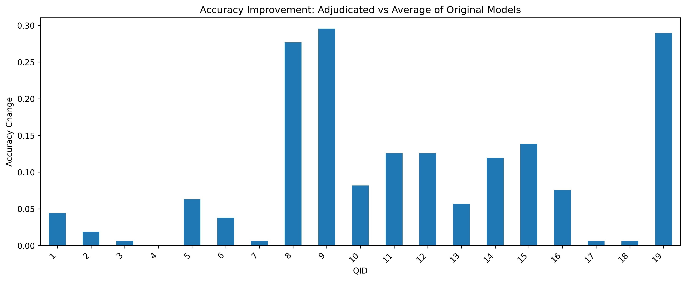
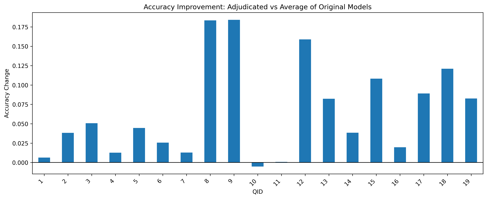

#  AI-Assisted Scientific Paper Understanding and Evaluation

## Overview

This project investigates how artificial intelligence (AI) can **read scientific papers**, **extract key information**, and **answer domain-specific research questions**.  
Our system performs **three independent runs**, each generating detailed answers with **supporting evidence and rationale**.  
An **AI expert adjudicator** then reviews all three runs and selects the **best, most coherent answer** for each question.

The final goal is to assess how closely AI-derived outputs align with a **human-curated gold standard**, and to explore whether an adjudication-based approach can improve scientific comprehension accuracy.

---
## Significance and Objective

Scientific databases such as those tracking HIV drug resistance depend on accurate and up-to-date information extracted from the primary literature. However, **manual curation**:reading each paper, identifying relevant experiments, and summarizing their findings,is a slow and resource-intensive process that limits scalability.

This project explores how an **AI-based adjudication framework** can accelerate and enhance literature curation by automatically reading and interpreting papers, verifying consistency across multiple reasoning paths, and producing **high-confidence summaries** suitable for database integration.

Our initial application focuses on HIV drug resistance research, where the system extracts key details such as drug susceptibility data and mutation effects, tasks that traditionally require expert biologists to perform manually. By automating this process, the tool can:

- **Substantially reduce human workload** in maintaining specialized scientific databases.  
- Provide **transparent, evidence-linked outputs** that remain interpretable to domain experts.  
- Enable **continuous, semi-automated updates** as new literature becomes available.

**What is novel about our approach:**  
Unlike standard single-pass AI extraction, this system performs **three independent QA runs per question**, capturing diverse reasoning paths and revealing inconsistencies or uncertainties in model outputs. A dedicated **Expert Adjudicator Agent** then critically reviews these multiple outputs, **audits the validity of cited evidence**, checks **domain-specific understanding**, and synthesizes a **single, high-confidence answer**. This two-stage, multi-agent design improves accuracy, provides interpretable rationales, and systematically **addresses common AI errors** such as missing evidence, citation misuse, or domain misunderstandings.

While this prototype focuses on HIV, the underlying approach using **multi-agent reasoning and expert adjudication** offers a **general blueprint for scientific information extraction**. With minor adaptation, the same framework could assist in other domains where structured knowledge must be distilled from large bodies of research.

---
## Workflow Description

  

### Data Preparation

- Collect and preprocess full-text scientific papers.

- Define structured, domain-specific question sets.

### AI Extraction & QA Runs (x3)

- Perform three independent runs using the same AI model.

- Each run reads the full text of the paper and produces:

    - Answer

    - Evidence (quoted text)

    - Rationale (model reasoning)

### AI Adjudication

- A separate “expert” AI model reviews the three sets of answers.

- It considers both the content and the rationale of each run.

- The adjudicator selects the best-supported or most reasonable answer.

- No scoring is performed — the outcome is a chosen final answer.

### Human Gold Standard Comparison

- The adjudicated answer is compared to the expert-annotated gold standard.

- Agreement rates and qualitative differences are analyzed.

---

## Results

### Average of 3 Runs vs Adjucator Accuracy 

#### GPT-5

  

  

#### Claude Opus 4.1

  

  

#### DeepSeek Chat V1

  

  

#### Overall Trend & Analysis

### Comparison Across Models

### Cost Analysis

## Limitations and Going Forward