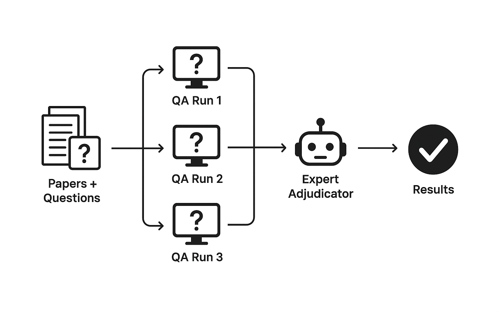
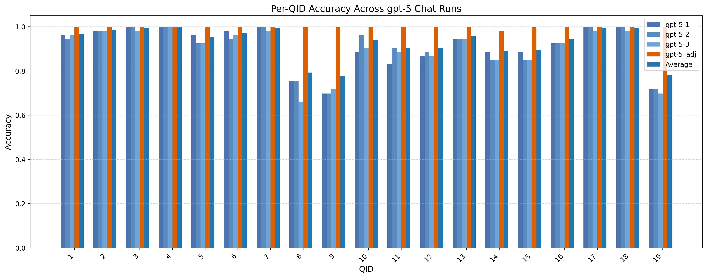
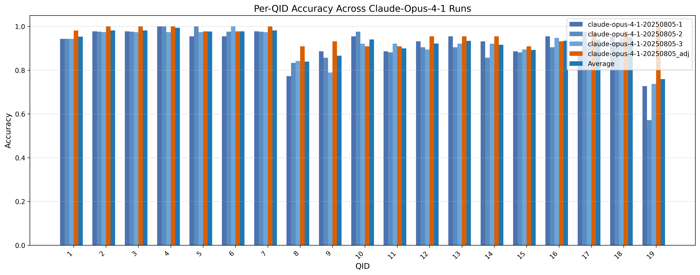
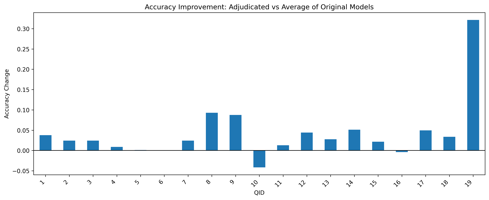
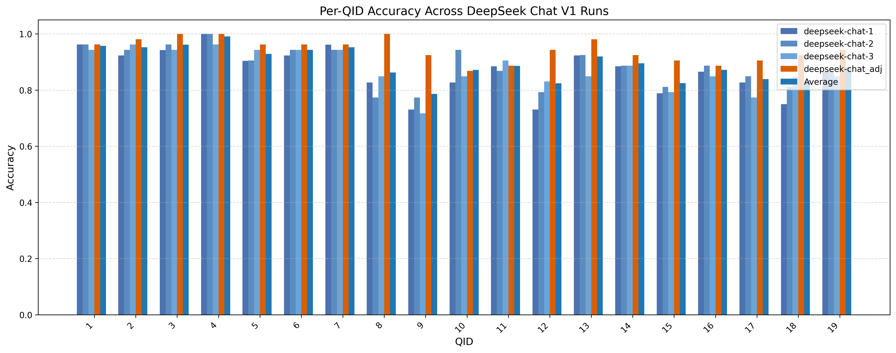
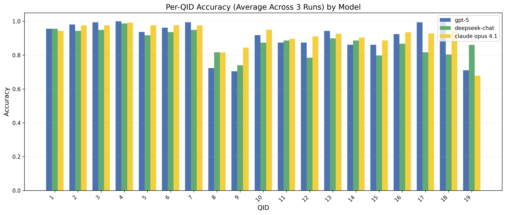
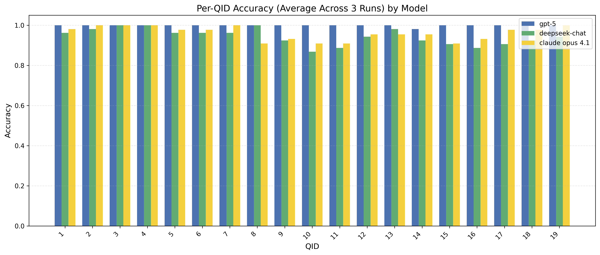

#  AI-Assisted Scientific Paper Understanding and Evaluation

## Overview

This project investigates how artificial intelligence (AI) can **read scientific papers**, **extract key information**, and **answer domain-specific research questions**.  
Our system performs **three independent runs**, each generating detailed answers with **supporting evidence and rationale**.  
An **AI expert adjudicator** then reviews all three runs and selects the **best, most coherent answer** for each question.

The final goal is to assess how closely AI-derived outputs align with a **human-curated gold standard**, and to explore whether an adjudication-based approach can improve scientific comprehension accuracy.

---
## Significance and Objective

Scientific databases such as those tracking HIV drug resistance depend on accurate and up-to-date information extracted from the primary literature. However, **manual curation**:reading each paper, identifying relevant experiments, and summarizing their findings,is a slow and resource-intensive process that limits scalability.

This project explores how an **AI-based adjudication framework** can accelerate and enhance literature curation by automatically reading and interpreting papers, verifying consistency across multiple reasoning paths, and producing **high-confidence summaries** suitable for database integration.

Our initial application focuses on HIV drug resistance research, where the system extracts key details such as drug susceptibility data and mutation effects, tasks that traditionally require expert biologists to perform manually. By automating this process, the tool can:

- **Substantially reduce human workload** in maintaining specialized scientific databases.  
- Provide **transparent, evidence-linked outputs** that remain interpretable to domain experts.  
- Enable **continuous, semi-automated updates** as new literature becomes available.

**What is novel about our approach:**  
Unlike standard single-pass AI extraction, this system performs **three independent QA runs per question**, capturing diverse reasoning paths and revealing inconsistencies or uncertainties in model outputs. A dedicated **Expert Adjudicator Agent** then critically reviews these multiple outputs, **audits the validity of cited evidence**, checks **domain-specific understanding**, and synthesizes a **single, high-confidence answer**. This two-stage, multi-agent design improves accuracy, provides interpretable rationales, and systematically **addresses common AI errors** such as missing evidence, citation misuse, or domain misunderstandings.

While this prototype focuses on HIV, the underlying approach using **multi-agent reasoning and expert adjudication** offers a **general blueprint for scientific information extraction**. With minor adaptation, the same framework could assist in other domains where structured knowledge must be distilled from large bodies of research.

---
## Workflow Description

  

### Data Preparation

- Collect and preprocess full-text scientific papers.

- Define structured, domain-specific question sets.

### AI Extraction & QA Runs (x3)

- Perform three independent runs using the same AI model.

- Each run reads the full text of the paper and produces:

    - Answer

    - Evidence (quoted text)

    - Rationale (model reasoning)

### AI Adjudication

- A separate “expert” AI model reviews the three sets of answers.

- It considers both the content and the rationale of each run.

- The adjudicator selects the best-supported or most reasonable answer.

- No scoring is performed — the outcome is a chosen final answer.

### Human Gold Standard Comparison

- The adjudicated answer is compared to the expert-annotated gold standard.

- Agreement rates and qualitative differences are analyzed.

---

## Results

### Average of 3 Runs vs Adjucator Accuracy 

#### GPT-5

  

  

#### Claude Opus 4.1

  

  

#### DeepSeek Chat V1

  

  

#### Overall Trend & Analysis

Across all three evaluated LLMs (Claude, DeepSeek, and GPT-5), adjudication consistently improved model accuracy on the 19 HIV-literature interpretation questions. While the magnitude of improvement varied by model, the overall pattern of which questions benefited most was highly consistent across all bar charts.

Large, Consistent Gains on Complex or Hard-to-Answer Questions (Q8, Q9, and Q19)

The largest accuracy gains were observed on Q8 (sequencing method), Q9 (sample cloning), and Q19 (public availability of sequences), with improvements frequently ranging from 0.10 to over 0.30. These questions are inherently more challenging because they require synthesis of multiple text elements, interpretation of subtle methodological details, or verification of external links. The adjudicator effectively corrected systematic errors that base models repeatedly made, particularly on these complex, categorical or verification-focused tasks.

Occasional Small Decreases

A few questions, such as Q10 (single genome sequencing), showed slight decreases in accuracy for some models, particularly DeepSeek and Claude, often around –0.02 to –0.04. These minor drops occurred primarily when base model outputs were already correct but the adjudicator over-corrected. Despite these occasional negative deltas, the overall effect of adjudication remained strongly positive across the question set.

Summary

Overall, adjudication provides the greatest benefit for complex categorical and verification tasks, moderately improves simpler Boolean and easier categorical questions, and rarely introduces small negative effects. This pattern highlights the adjudicator’s role in reducing systematic errors and enhancing reliability in interpreting HIV literature.

### Adjudication vs Basic Performance

Across the three evaluated LLMs, Questions 8 and 9 showed the largest performance gains. These items were predominantly yes/no questions, and many responses were previously marked as **NaN** (“not reported”) when the models were run independently. Notably, in several cases where all three model outputs were erroneous, the adjudicator was still able to identify, locate, and correct the mistake. This demonstrates that the adjudication step does not simply rely on the outputs of the individual model runs but can independently resolve errors, an important indicator of its added value.

The adjudicator improves performance in several key scenarios:
  

#### 1. When the three AI runs yield inconsistent answers
Even when the three independent runs disagree with one another, the adjudicator can examine the supporting evidence and select the answer that is better grounded in the original text. Instead of defaulting to majority vote or superficial alignment, it makes a reasoned judgment about which answer is more credible.
  

#### 2. When all three answers are consistent but still incorrect
The adjudicator does not become misled by consistency. Even if all three model runs produce the **same wrong answer**, it evaluates the reasoning and evidence independently. It does not simply choose the answer that “fits best” among incorrect options; it can override all of them when necessary.

This includes multiple failure modes:

**a. All three AI runs fail to follow the prompt format**  
For example, when the question requires a **yes/no** answer but all three models return **NaN** or **not reported**, the adjudicator can re-examine the text, extract the relevant evidence, and produce a clear, well-formatted yes/no answer that matches the expected output format.

 

**b. All three AI runs hallucinate or misinterpret the content**  
When the models provide the same false interpretation, due to missing domain knowledge or hallucinated details, the adjudicator can detect flawed reasoning, identify unsupported statements, and correct the answer using only information grounded in the paper.

 

**c. All three AI runs miss crucial parts of the text**  
Sometimes the models base their answers on only a subset of the relevant context and overlook key passages. The adjudicator can re-read the full text, locate the overlooked information, and provide a correct answer that incorporates the complete set of evidence.

  

### Comparison Across Models

  

  

The comparison of the three models: GPT-5, DeepSeek Chat V1, and Claude Oput 4.1, shows their average per question accuracy across three runs. Questions 8, 9, and 19 had the lowest overall accuracy. Questions 9 and 19 are Boolean, which are particularly challenging for the models and often left unreported in individual runs, while Question 8 is categorical, highlighting difficulties with more variable answer types. GPT and Claude generally performed slightly better than DeepSeek, although for the Boolean Question 19, DeepSeek was comparable or slightly better. This highlights both the relative strengths of GPT and Claude across most question types and the persistent difficulty of certain items for all models.

With the adjudicator applied, GPT-5 consistently achieved the highest overall performance, followed by Claude and then DeepSeek. After adjudication, GPT-5 reached an average accuracy of approximately 0.99, Claude 0.96, and DeepSeek 0.94. In comparison, before adjudication, the average accuracies were lower, with GPT-5 at 0.91, Claude at 0.92, and DeepSeek at 0.88. This demonstrates that the adjudication step not only improves accuracy for all models but also amplifies the performance differences, particularly highlighting GPT-5’s relative strength in resolving previously unreported or incorrect responses.

### Cost Analysis

## Limitations and Going Forward
### Takeaway
The adjudication step is not a passive aggregator of model outputs. It is an independent reasoning layer that can:

- Resolve contradictions between runs by weighing evidence;
- Overturn unanimous but incorrect model outputs by applying independent critical analysis; and
- Recover missing or misread evidence by re-examining the full source text.

These behaviors make adjudication a valuable component of the pipeline that showed significant improvement, addressing multiple common problems that the current AI models have when performing information-extraction tasks.

### Limitations

Despite its promise, several limitations remain:

- Dependence on Source Text Quality: AI models can only extract what is explicitly or implicitly present in the paper. Poorly reported experiments, ambiguous wording, or missing metadata can still lead to incomplete or incorrect answers, even after adjudication.

- Categorical vs. Boolean Challenges: While adjudication improves performance on both Boolean and categorical questions, categorical questions—such as drug types, sample sources, or GenBank accession numbers—remain more error-prone due to their open-ended nature and diverse possible answers.

- Scaling to Large Corpora: Running three independent QA passes plus adjudication for each paper increases computational cost and processing time. While feasible for focused datasets (e.g., HIV drug resistance papers), scaling to tens of thousands of publications will require optimizations or selective triaging.

- Reliance on AI Expertise: The adjudicator itself is an AI model trained to critically evaluate outputs. Systematic biases in the adjudicator could propagate if not monitored, and the quality of adjudication may vary across domains or as models evolve.

- Evaluation Limitations: Agreement with the human gold standard measures overall correctness but may not capture subtle differences in evidence interpretation or nuanced reasoning. Some outputs may be factually correct yet diverge from the gold standard due to interpretive differences.

### Going Forward

Future directions to strengthen the framework include:

- Adaptive Question Prioritization: Dynamically assigning more adjudication resources to difficult categorical or verification-focused questions, reducing unnecessary computation for simpler Boolean tasks.

- Multi-Source Integration: Extending the system to cross-reference multiple papers or databases, allowing adjudication to resolve inconsistencies and fill gaps in evidence from a broader context.

- Human-in-the-Loop Feedback: Incorporating expert review to periodically audit adjudicated answers, refine adjudicator heuristics, and identify domain-specific pitfalls, further improving reliability.

- Model Updates and Fine-Tuning: Iteratively retraining both the base QA models and the adjudicator on newly curated data can reduce recurring errors and improve generalizability across scientific domains.

- Automated Evidence Verification: Developing mechanisms to automatically check links, accession numbers, and reported experimental data can further reduce errors in questions like public sequence availability or GenBank accession reporting.